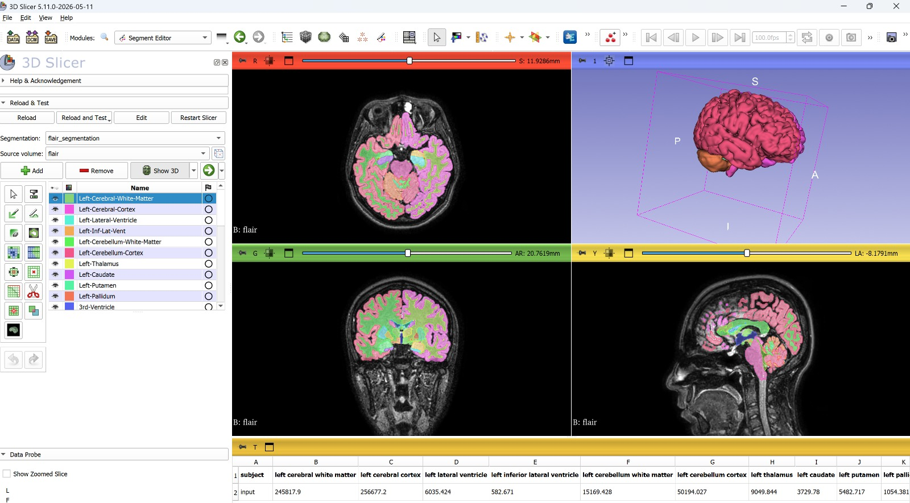

# SlicerSynthSeg


3D Slicer extension for automated brain MRI segmentation using SynthSeg.
Contrast-agnostic (T1, FLAIR, T2). Outputs labeled brain structures + volumes.

## Requirements

- 3D Slicer 5.x
- Miniconda or Anaconda
- ~8 GB RAM minimum (16 GB recommended)
- CPU is sufficient (GPU not required)

## Installation

### 1. Create the conda environment (in PowerShell/terminal, once)

```bash
conda create -n synthseg python=3.8 -y
conda activate synthseg
pip install tensorflow tf-keras "numpy<2" scipy nibabel gdown
```

> Note: this modern recipe was verified working today — the old TF 2.2 package is
> no longer available via pip on Windows, and this combination produces the same
> result.

### 2. Install the extension in 3D Slicer

- Clone or download this repository
- In Slicer: **Edit > Application Settings > Modules > Additional module paths**
- Add the path to the `SlicerSynthSeg/SlicerSynthSeg` folder
- Restart Slicer

### 3. Configure the environment (first time)

- Open the **SynthSeg** module (Segmentation category)
- Click **"Configure Environment"**:
  - **Python Executable**: path to your conda env `python.exe`
    (e.g. `C:/Users/.../anaconda3/envs/synthseg/python.exe`)
  - **SynthSeg Path**: path to the bundled `SynthSeg` folder (included in this repo)
- Click **"Download Model Automatically"** (downloads `synthseg_1.0.h5` via gdown, ~50 MB)
- Click **"Test Configuration"** to verify

### 4. Run segmentation

- Load a T1/FLAIR/T2 brain MRI volume
- Select it as **Input Volume**
- Click **"Run Segmentation"**
- Results: labeled segmentation + volume table (mm³)

## Notes

- CPU processing takes a few minutes per scan
- The model is downloaded automatically (not included in the repo due to size)
- Segments are automatically named (Left-Thalamus, Right-Caudate, etc.)

## License & Acknowledgements

This extension (SlicerSynthSeg module code) is released under the MIT License.

It bundles SynthSeg by B. Billot et al., licensed under Apache License 2.0
(see `SynthSeg/LICENSE.txt`). The SynthSeg source and per-file copyright headers
are preserved unchanged.

Original SynthSeg repository: https://github.com/BBillot/SynthSeg

If you use this tool in research, please cite:

> Billot B, Greve DN, Puonti O, Thielscher A, Van Leemput K, Fischl B, Dalca AV,
> Iglesias JE. "SynthSeg: Segmentation of brain MRI scans of any contrast and
> resolution without retraining." Medical Image Analysis, 2023.

## Author

Prof. Dr. Niyazi Acer (Retired, Erciyes University)
